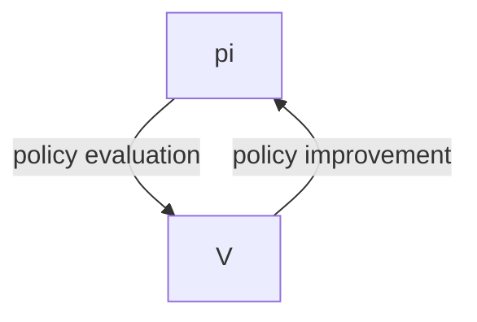

# RL: Monte Carlo
WHat MC do? Learn $v_*$ , $q_*$ based on experiance.

Entire episodes(consequence): 
$S_0,A_0,R_1,...,S_{\tau-1},A_{\tau-1},R_{\tau}$

$v_\pi(s)=\mathbb{E}_\pi[G_t|S_t=s]$

$V_\pi(s)=\frac{1}{N} \sum_{k=1}^{N}G_{S_k}$

$G_t=\sum_{k=0}^{T-\tau-1}\gamma^kR_{t+k+1}$

Based on Law of large numbers:

$$P(lim_{n\to\infty}\tilde{G}_s=v_\pi(s))=1$$

Advantages of Monte Carlo methods:
* The stimate of a state does not depends on the rest.
* The cost of stimating a state value is independent of the total number of states.
* DP waste more time on not important states.

* Begin with arbitary policy. do until recieve the final reward and then compute return(G) for different t's. Then improve the policy($\pi$). 

In below formula:

$\pi'(s)=argmax_a\sum_{s',r}p(s',r|s,a)[r++\gamma v_\pi(s')]$

$v(s)$ requires knowing the effects of tking each action beforehand. it is impossible here. so we MC use $q_\pi$ insetead.

$q_\pi(s,a)=\sum_{s',r}p(s',r|s,a)[r+\gamma v_\pi(s')]$

instead of $V(s)$, it uses $Q(s,a)$:

$\pi'(s)=argmax_{a}q_\pi(s,a)$

$$<\pi_0 \to Q_{\pi_0} \to
\pi_1 \to Q_{\pi_1} \to
... \to  Q_{\pi_0}
\to \pi_*>
$$
