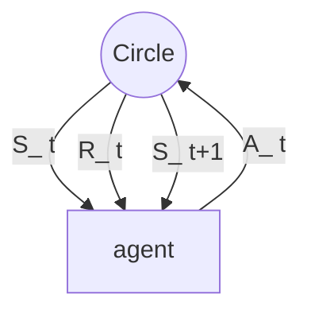

# RL: intro

Author:  Ali Safaroor Dehkordi

|key|definition|
|--|--|
|$S_t$|stater at time t|
|$A_t$|action at time t|
|$R_t$|reward at time t|
|$\tau$|trajectory  |
|$\pi$ | policy |
|$\pi_{*}$  | optimal policy  |
|$v_{\pi}(s)$  | state value based on policy $\pi$ |
|$q_{\pi}(s,a)$  | state action based on policy $\pi$  |
|G|return(sum of rewards)|
|$\gamma$|discount factor|

# $\pi$
* stochastic: $\pi(a|s)$ outpupt: probability of action a in state s
* deterministic: $\pi(s)$ outpupt: action a 
* goal: maximize reward (in the long run) $\leftrightarrow$ optimal policy 

For practical phase, let's look as [Intro](https://github.com/aSafarpoor/RL-simple-tutorial/blob/main/codes/intro.ipynb).
